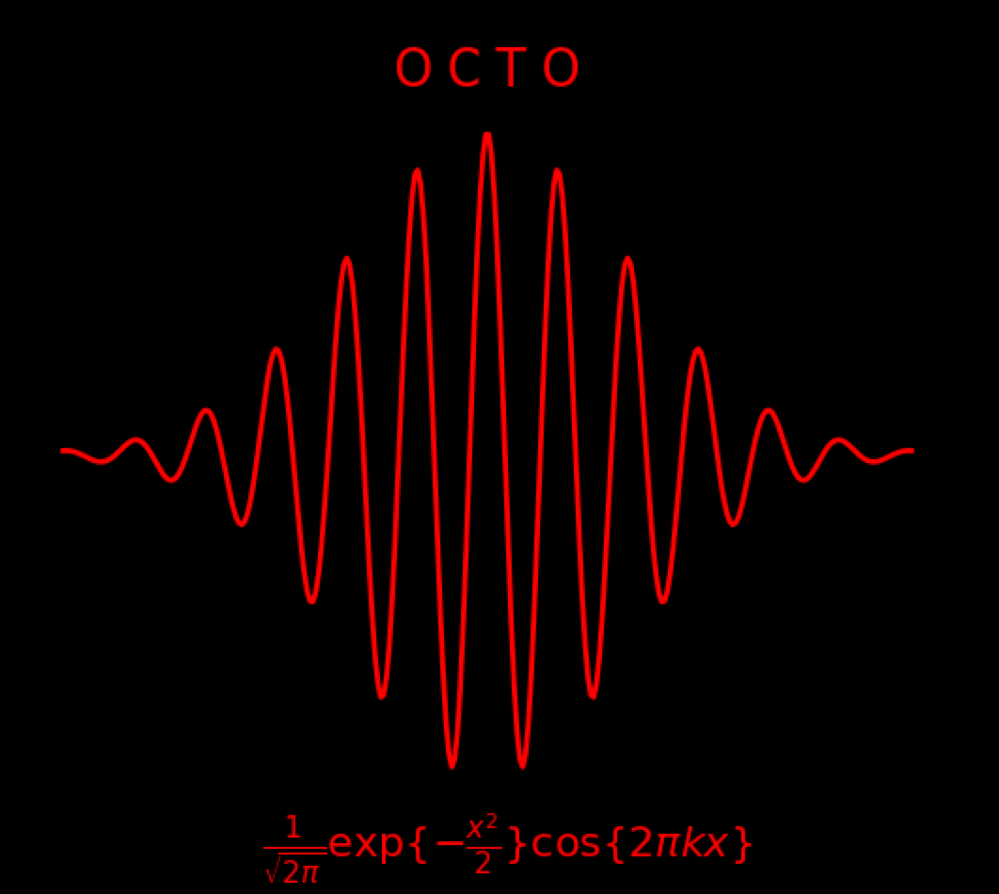

# Equinix-OCTO-Soliton
## Equinix OCTO Logo

A soliton or solitary wave is a self-reinforcing wave pulse that maintains its shape while it propagates at a constant velocity. 
When a soliton interacts with another soliton, it emerges from the "collision" unchanged.

